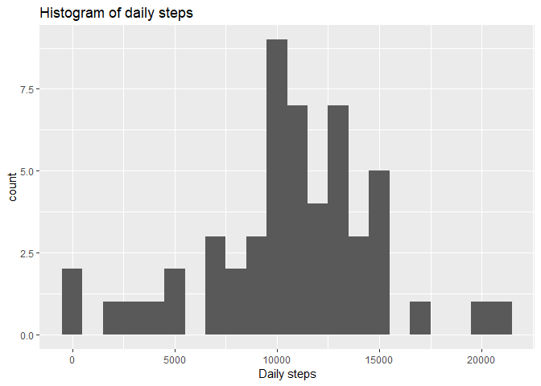
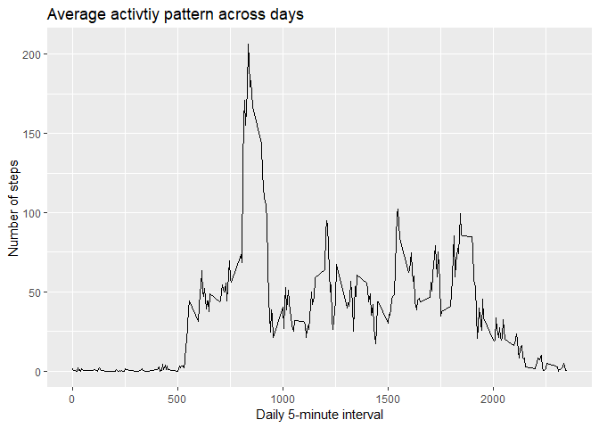
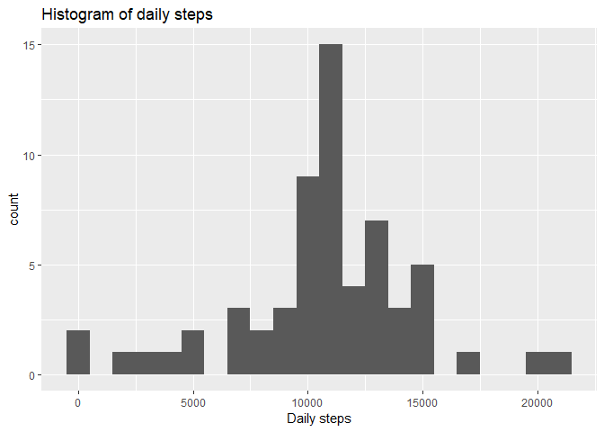
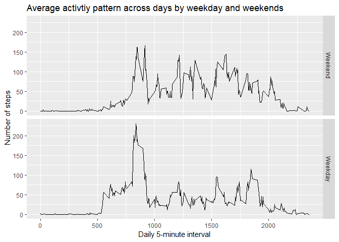

## Reading the data
First things first. Files for the data can be found [here](https://github.com/glima93/RepData_PeerAssessment1/blob/master/activity.zip). After the dataset is downloaded to working directory, we read it and prepare it for analysis. 

```r
data <- read.csv("./data/activity.csv", sep = ",", header = TRUE, na.strings = "NA")
data$date <- as.Date(as.character(data$date), "%Y-%m-%d")
data$steps <- as.numeric(data$steps)
```

## Distribution of total number of steps by day
Creating an histogram of total steps by day, with a binwidth of 1000 steps.

```r
total_day <- aggregate(steps ~ date, data, sum, na.rm = TRUE)
library(ggplot2)
histo_dailysteps <- ggplot(total_day, aes(total_day$steps)) +
                        geom_histogram(binwidth = 1000) + 
                        xlab ("Daily steps") +
                        ggtitle("Histogram of daily steps")
print(histo_dailysteps)
```

<!-- -->

The mean and median of the distribution of daily steps can be given by the following code:

```r
mean_steps <- format(round(mean(total_day$steps),0), nsmall = 0, big.mark = " ")
median_steps <- format(round(median(total_day$steps), 0), nsmall = 0, big.mark = " ")
```
On average, the individual takes about 10 766 by day. The median of her daily steps is 10 765.

## Daily activity pattern
Here we draw a time-series plot for the daily activity pattern of the subject in 5-minute intervals. First, we need to compute the average for each 5-minute interval across days. Secondly, we plot the data. 

```r
act_pattern <- aggregate(steps ~ interval, data, mean, na.rm = TRUE)
plot_act_pattern <- ggplot(act_pattern, aes(act_pattern$interval, act_pattern$steps)) +
                        geom_line() +
                        xlab("Daily 5-minute interval") +
                        ylab("Number of steps") +
                        ggtitle("Average activtiy pattern across days")
print(plot_act_pattern)
```

<!-- -->

The 5-minute interval, on average across all days in the dataset, that contains the maximum number of steps is given by:


```r
max_steps <- act_pattern$interval[which.max(act_pattern$steps)]
```
On average, the 5-minute interval with the maximum number of steps is 835. 

## Imputing missing values
First, we calculate the total number of missing values in the dataset.

```r
missing <- format(round(sum(is.na(data$steps)),0), nsmall = 0, big.mark = " ")
```
In total, there are 2 304 missing values. 
As a method to impute missing values, we will use the average across days for the corresponding 5-minute interval in which the steps were supposed to be measured. 


```r
mean_interval <- aggregate(steps ~ interval, data, mean, na.rm = T)
data2 <- merge(data, mean_interval, by = "interval", all = T)
names(data2)[names(data2) == "steps.x"] <- "steps"
names(data2)[names(data2) == "steps.y"] <- "avg_steps"
```
We use the ifelse function to impute the values of average steps of the specific 5-minute interval across days when the number of steps for the specific interval is missing. data2 is, thus, the new dataset with the missing data filled in.

```r
data2$steps <- ifelse(!is.na(data2$steps), data2$steps, data2$avg_steps)
data2 <- data2[with(data2, order(date, interval)),]
```
We now make the histogram of total number of steps taken each day for the new dataset. 


```r
total_day2 <- aggregate(steps ~ date, data2, sum, na.rm = TRUE)
library(ggplot2)
histo_dailysteps2 <- ggplot(total_day2, aes(total_day2$steps)) +
                        geom_histogram(binwidth = 1000) + 
                        xlab ("Daily steps") +
                        ggtitle("Histogram of daily steps")
print(histo_dailysteps2)
```

<!-- -->
The mean and median of the total number of steps is again given by:

```r
mean_steps2 <- format(round(mean(total_day2$steps),0), nsmall = 0, big.mark = " ")
median_steps2 <- format(round(median(total_day2$steps), 0), nsmall = 0, big.mark = " ")
```
The mean of total daily steps is 10 766, which is the same as the mean without the imputed missing values. The median is 10 766, which compares to a median of 10 765, in case no missing values are imputed.

## Activity patterns on weekdays and weekends
I am working on a computer from Portugal. So, first, let's translate the days of the week of my Windows system into English.


```r
Sys.setlocale("LC_TIME","English")
```

```
## [1] "English_United States.1252"
```

```r
weekdays(Sys.Date()+0:6)
```

```
## [1] "Thursday"  "Friday"    "Saturday"  "Sunday"    "Monday"    "Tuesday"  
## [7] "Wednesday"
```
Let's first create a variable that gives us the days of the week and, second, create a factor variable for identifying weekends and weekdays. 


```r
data2$week_day <- weekdays(data2$date)
weekday <- c('Monday', 'Tuesday', 'Wednesday', 'Thursday', 'Friday')
data2$day <- factor((data2$week_day %in% weekday),
                    levels = c(FALSE, TRUE),
                    labels = c('Weekend','Weekday'))
```
We now create a plot of the daily activity pattern separately by weekdays and weekends. 


```r
act_pattern2 <- aggregate(steps ~ interval + day, data2, mean, na.rm = TRUE)
plot_act_pattern2 <- ggplot(act_pattern2, aes(act_pattern2$interval, act_pattern2$steps)) +
                        geom_line() +
                        facet_grid(act_pattern2$day ~ .) +
                        xlab("Daily 5-minute interval") +
                        ylab("Number of steps") +
                        ggtitle("Average activtiy pattern across days by weekday and weekends")
print(plot_act_pattern2)
```

<!-- -->

